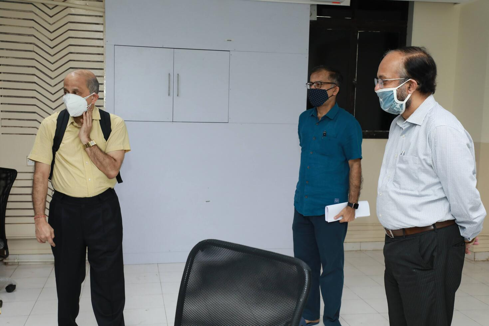
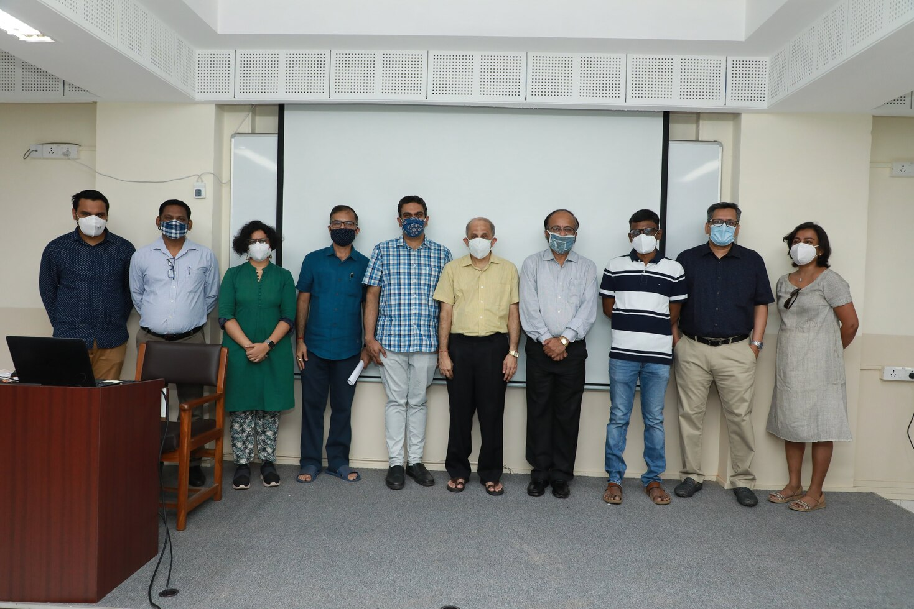
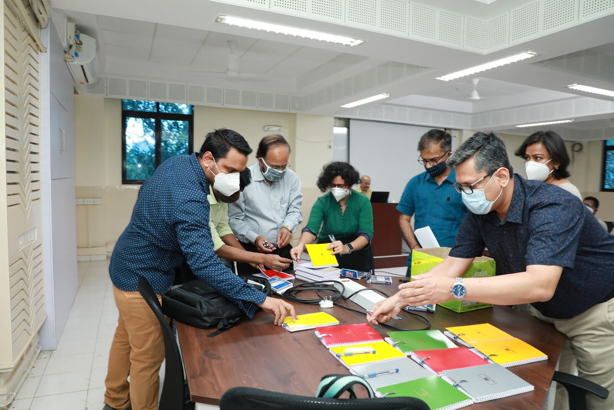
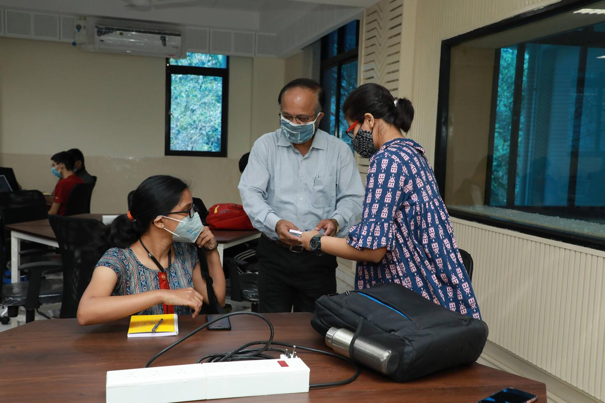
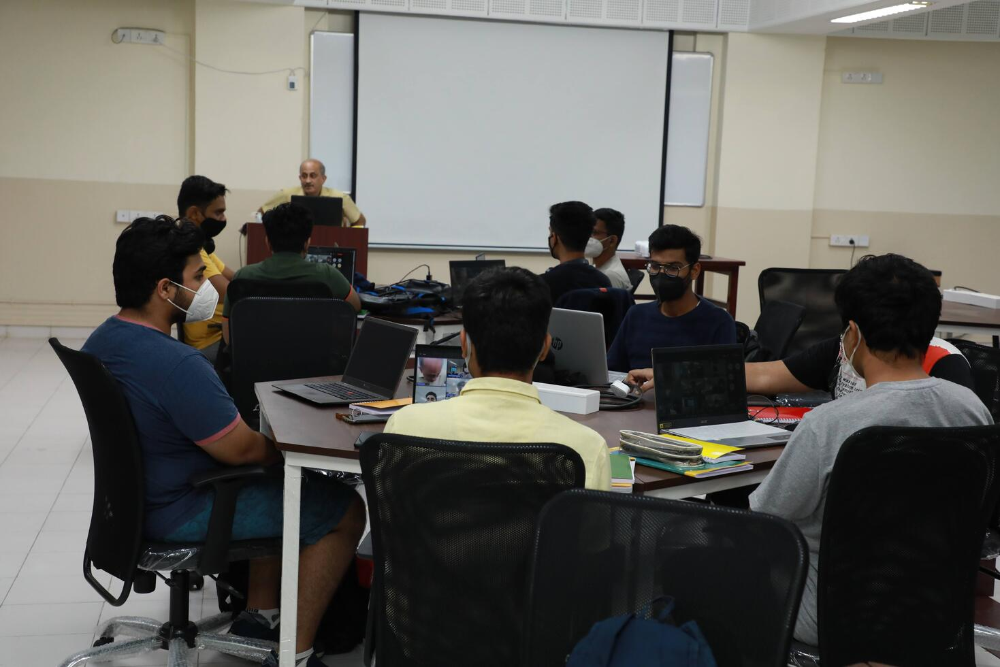

# First Lecture in the Collaborative Classroom

:octicons-calendar-24:<b> February 4, 2022</b>

Prof. V. M. Gadre conducted the first lecture in the new Collaborative Classroom for his course EE338 Digital Signal Processing on February 4, 2022. To mark this occasion, several faculty members were present along with MBF CEO Ms. Damayanti Bhattacharya. Ms. Neha Chaudhari, Mr Harish Rajput (EEACR) and Shivajee Tiwari (MTech RA, MBF Classrooms) were also present.

The lecture was held in hybrid mode with some students joining the lecture via video call on MS Teams. Prof. Gadre has a tradition of giving each student a pen and a notebook in the first lecture of his courses. As this was the first lecture with in-person attendance, he had brought the stationery to the lecture. All guests present helped with preparing the stationery for distribution.

Prof. Kishore Chatterjee (HoD, EE) distributed the pens and notebooks to the students. He then addressed the students. It was their first in-person lecture in EE department since they joined IIT Bombay in late 2020.

 
Then the lecture commenced.
 

To see more pictures from the event, [click here](https://photos.app.goo.gl/CZfW1z6kpA4Lsk6L7){:target="_blank"}
