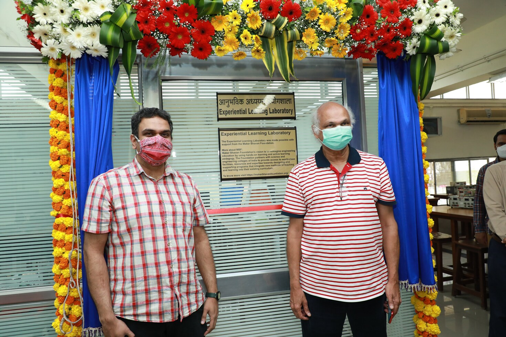
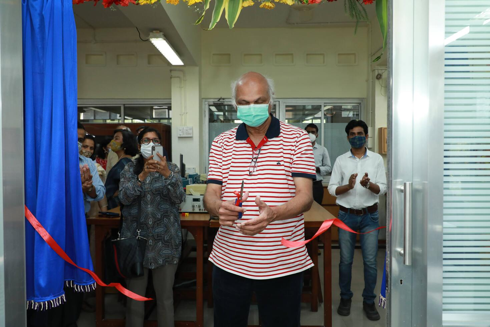
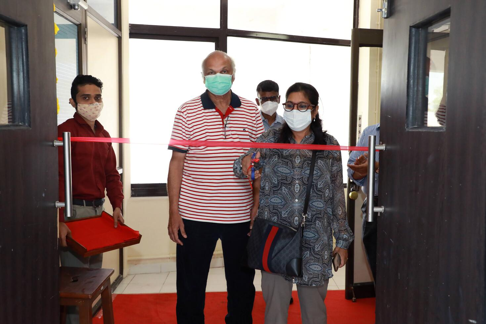
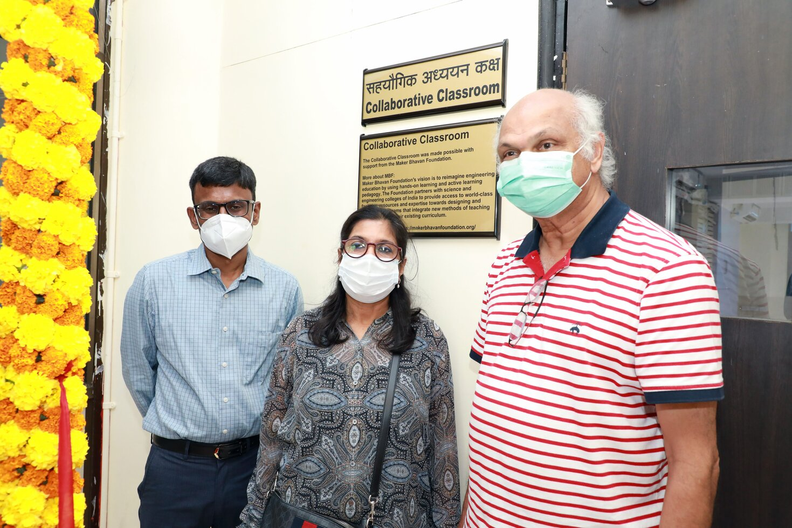

# Inauguration of CC and ELL

:octicons-calendar-24:<b> February 14, 2022</b>

The Collaborative Classroom and the Experiential Learning Laboratory were inaugurated by Dr. Hemant Kanakia (Founder, MBF) and Ms. Paula Mariwala (Member, MBF Board of Advisors) on February 14th, 2022. The inauguration was followed by an interaction session between the guests, faculty, and students.

To see more pictures from the event, [click here](https://photos.app.goo.gl/76xtPY9dy4mnPADCA){:target="_blank"}

