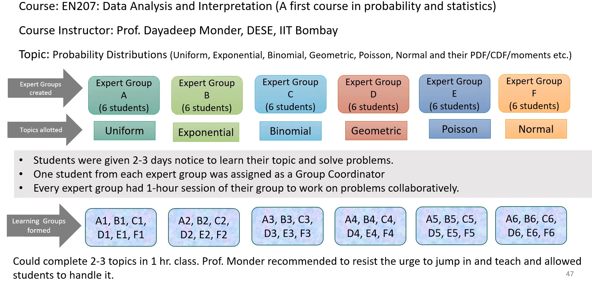

# Notes from Talk on Collaborative Learning Spaces

## Context
The Collaborative Classroom is an instance of a Collaborative Learning Space (CLS). It is meant to facilitate active and collaborative learning.

The [Parimal and Pramod Chaudhari Centre for Learning and Teaching (PPCCLT)](http://www.ppcclt.iitb.ac.in/) at IIT Bombay has a state-of-the-art [collaborative learning research laboratory](http://www.ppcclt.iitb.ac.in/collaborative-learning-space/) (CLRL). It was completed in 2020.

To understand the challenges and opportunities in using the CC effectively, we invited **Dr. Mrinal Patwardhan, Academic Program Coordinator, PPCCLT**, to give a seminar about collaborative learning spaces. The seminar was held on Zoom on October 13th, 2021.

## Notes from Talk
Here are some salient points from her talk.

* **Collaborative Learning Spaces**: Formal spaces intentionally designed to promote *active learning*.
* **Studio Approach to Instructional Spaces**: The classroom is designed for discussions between small groups.
    

* **What type of learning process is the CLS trying to foster? Why?**
    * Students form small groups and work collaboratively in small teams.
    * The approach results in deeper learning and an enhanced learning experience.
    * Students use a variety of resources as they learn from peers and instructors.
* **Does it work?**
    * Numerous studies, with many focusing on STEM students, have demonstrated significant positive student outcomes.
        * Meaningful student interactions
        * Decreased failure rates
        * Increased student satisfaction
    * See review paper on the efficacy of CLSs covering 37 studies for more information.
        * [R. Talbert and A. Mor-Avi, A space for learning: An analysis of research on active learning spaces, Heliyon, 2019](https://www.sciencedirect.com/science/article/pii/S2405844019366265)
* **Findings in CLS Research**
    * *Improved Learning Outcomes*
        * All studies reported either **improved learning outcomes** for students in CLSs or no significant difference in learning outcomes compared to traditional classrooms
        * Improvement in learning outcomes were **most pronounced among low-achieving and minority students.**
    * *Improved Student Engagement*
        * Preference for learning in CLSs
        * **Increased motivation** to attend class
        * Increased **willingness to participate** actively in class
        * Increased **interaction and deepened relationships** with their peers and instructor
        * Fostered a sense of community and belonging
    * *Instructors' practices and beliefs*
        * Instructors tend to change their instructional practices and their perceptions of their roles as instructors
        * Instructors used active learning techniques more frequently
* **The room itself is not enough**
    * The collaborative learning space does not magically result in better learning. The pedagogy in CLSs has to be deliberately designed for active learning.
    * [Kelsey J. Metzger, David Langley, The Room Itself is Not Enough: Student Engagement in Active Learning Classrooms, *College Teaching*, 2020](https://www.tandfonline.com/doi/full/10.1080/87567555.2020.1768357)
    * The value of CLSs lies in the enactment of student-centred pedagogies.
    * The architecture and affordances in such spaces provide the required nudging towards it.
    * One **must use active learning strategies**
### **What is Active Learning?**
* Active learning involves instructional strategies wherein
    * Students go beyond listening, copying of notes, execution of prescribed procedures
    * Instructor designs activities that **require a majority of students** to talk, write, reflect, and express their thinking.
    * It requires students to engage cognitively and meaningfully with the course content.
* *Example*: Suppose a student is listening to a lecture. The following list describes student actions in **increasing order of cognitive engagement**.
    * Listening without doing anything else
    * Taking verbatim notes, copying solution steps, repeating or rehearsing
    * Reflecting out loud, drawing concept maps, asking questions
    * Defending and arguing a position in pairs or small group
* The above example is an instance of the **ICAP Framework** which stands for Interactive, Constructive, Active, Passive (in reverse order in the example).
*  [Michelene T. H. Chi & Ruth Wylie (2014), The ICAP Framework: Linking Cognitive Engagement to Active Learning Outcomes, Educational Psychologist, 49:4, 219-243](https://www.tandfonline.com/doi/full/10.1080/00461520.2014.965823)
### **Active Learning Strategies**

*  Peer Instruction 
        *Eric Mazur, Harvard University, early 1980s*
* Think-Pair-Share
        *Frank Lyman, University of Maryland, early 1980s*
* Many others
    * Team-Pair-Solo
    * Problem-based learning
    * Just-in-Time Teaching
    * Role-play
    * Jigsaw
    * Case-based learning
    * Peer-review
    * Flipped classroom
    * Pair programming
#### **Peer Instruction Strategy**

*  Instructor asks a **multiple choice conceptual question**
*  Students answer individually
* Instructor allows students to discuss among themselves
* Students answer again
* Misconceptions are usually clarified
* The questions can be chosen to
    * test conceptual understanding
    * apply ideas in real world context
    * predict results of lecture demo, experiment, simulation, or algorithm (describe an experiment, ask students to predict the result, then show the demo or video).

#### **Think-Pair-Share Strategy**

    
#### **Jigsaw: Cooperative Learning Strategy**

 * Suppose a topic has four subtopics
 * Students are divided in to four groups to learn about each subtopic. They form the expert groups for a particular subtopic.
 * Form learning groups containing one student from each learning group.
 * Each expert teaches his/her subtopic to his learning group.
 * Instructor summarizes the topics at the end.

### Common Features of Effective CLS Activities
The following points describe strategies which have been seen to be effective in CLSs.

* Most of the **information transmission** in the form of a lecture by the instructor is significantly reduced or **moved out of the classroom**
* Most activities are supported by **graded** pre-class reading, homework, and quizzes or post-class homework
* Students often work in **small teams** on activities designed to provide them with a deeper understanding of the topic
* Classroom activities are typically followed by some form of **whole-class synthesis facilitated by the instructor**
    * Whatever learning has been taking place at the individual level is summarized by the instructor
    * This may take the form of a discussion, a short assessment, or a mini-lecture.
* [A Guide to Teaching in the Active Learning Classroom: History, Research, and Practice, 2016, Paul Baepler, J. D. Walker, D. Christopher Brooks, Kem Saichaie, Christina I. Petersen](https://books.google.co.in/books?id=0XZvDwAAQBAJ&printsec=frontcover#v=onepage&q&f=false)

### Some pointers for using a CLS
* It is better to **start with a few classes in a CLS** rather than an entire course in the CLS.
* Consider modifying just **a single lesson/topic/unit as a pilot** before thinking of running/redesigning an entire course in the CLS.
* Pick some topics/modules that have the potential for planning active learning activities
    * Topics which students generally find difficult to grasp are good candidates
* May use micro-lectures -- shorter lectures interspersed between periods of student activity
* Use of the **Backward Design Approach** may help in planning the use of the CLS.

#### What is the Backward Design Approach?

* Backward Design Approach for using a CLS
    * What should students take away/develop by using the CLS for a topic/module/course?
    * How will I assess that students have developed the required knowledge/skill/competency?
    * What learning activities do I need to plan for students to develop the required knowledge/skill/competency?
* See [Planning for using a CLS](#Planning-for-using-a-CLS) for possible answers to above questions

### Pointers for identifying topics suitable for a CLS
Topics involving the following are usually suitable
* Deep conceptual understanding
* Open-ended problem solving
* Design-based problem solving
* Real-world problem solving
* Software-based laboratory
* Mathematical modeling
* Short hands-on experimentation

#### Example 1: Mathematical Modeling

#### Example 2: Jigsaw in EN207: Data Analysis and Interpretation

### Planning for using a CLS

## Main Takeaways
- Active learning techniques are necessary to realize the benefits of using a  CLS i.e. "*the room itself is not enough*"
- Start small if you are new to using a CLS
    - A few modules/topics instead of whole course in CLS
- Identify topics which are typically hard to grasp for students
- Identify active learning techniques which can be used
- Design the exercise which will happen in the CLS

## About Dr. Mrinal Patwardhan
Dr. Patwardhan holds a post-graduate degree in Electronics Engineering from VJTI, Mumbai and a PhD in Educational Technology from IIT Bombay. Before joining PPCCLT, Mrinal was an Engineering faculty for two decades. She is actively involved in developing the collaborative learning research laboratory (CLRL) at PPCCLT.