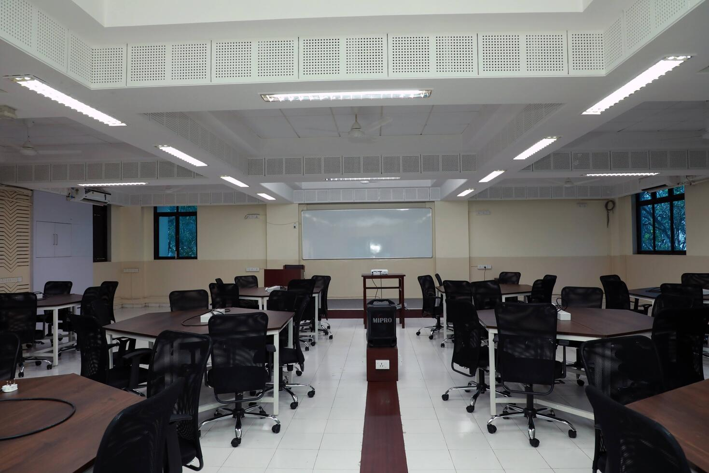

# Facilities in the Collaborative Classroom

## Layout and Furniture

**Tables and chairs**: The CC has 10 hexagonal tables, each seating 6 students. It also has 60 swivel chairs.

**Reconfigurable layout**: Each hexagonal table is made of two half-hexagonal tables which can move independently. While the default configuration is shown below, the tables can be re-arranged to make other configurations.

**Laptop charging points**: To enable reconfiguration, the tables do not have electrical points. However, the classroom has 10 extension cords with which can be used to provide power for laptops placed on the tables.

## AV Equipment

There are four TV screens in the CC for projection: two on either side of the stage and two on the sides of the room. A sound system consisting of six speakers (2 wall-mounted, 4 ceiling-mounted) is also installed.

## Laptops
By September 2022, the classroom will be equipped with 20 laptops which can be used for computer-based exercises. The idea is that each of the 10 tables will have two laptops each.