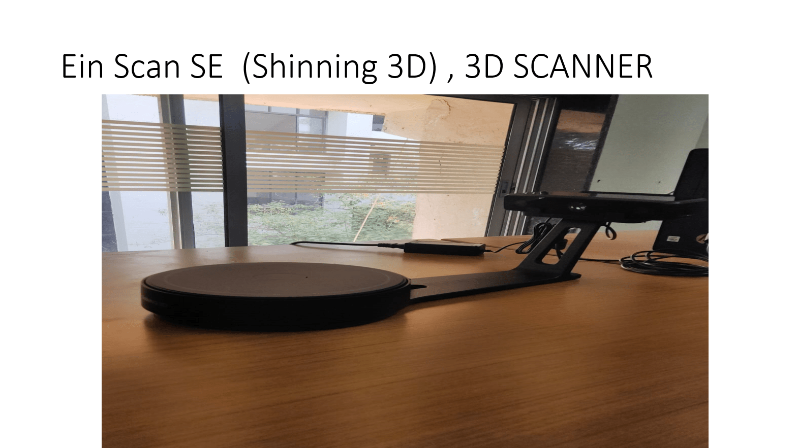

# Equipment

## SINGLE NOZZLE 3D-PRINTER

## User Manual [Last Update : 25/05/2022]

[Single Nozzle 3D-Printer (Julia Advance)_Manual](../ell/Manuals/Single_Nozzle_3D-Printer%20(Julia%20Advance)%20_User_Manual(25-05-2022).pdf)

[Single Nozzle 3D-Printer (Quick Guide)](../ell/Quick_Guides/Julia_Single_Nozzle_Printer_Summary(25-05-2022).pdf)

## DUAL NOZZLE 3D-PRINTER 

## User Manual [Last Update : 25/05/2022]

[Dual Nozzle 3D-Printer (Julia Pro Dual)_Manual](../ell/Manuals/Dual_Nozzle_3D-Printer_(Julia%20Pro%20Dual)%20User_Manual(25-05-2022).pdf)

[Dual Nozzle 3D-Printer (Quick Guide)](../ell/Quick_Guides/Julia_Dual_Nozzle_Printer_Summary(25-05-2022).pdf)

## LASER CUTTER

## User Manual [Last Update : 25/05/2022]

[CO2 LASER CUTTER (AccuCut 6090)_Manual](../ell/Manuals/CO2%20Laser_Cutter%20(AccuCut%206090%20)_User_Manual(25-05-2022)..pdf)

[CO2 LASER CUTTER (Quick Guide)](../ell/Quick_Guides/Laser-Cutter_Summary_(25-05-2022).pdf)

## 3D-Scanner 

## User Manual [Last Update : 25/05/2022]

[3D-Scanner (Ein Scan SE)_Manual](../ell/Manuals/3D-SCANNER_(Ein%20Scan%20SE)_User%20Manual(25-05-2022).pdf)

[3D-Scanner (Quick Guide)](../ell/Quick_Guides/3D%20scanner%20summary%20(25-05-2022).pdf)

## Vacuum Forming

## User Manual [Last Update : 25/05/2022]

[Vacuum Forming (MayKu)_Manual](../ell/Manuals/Vacuum%20forming%20machine%20(MayKu)_User%20Manual(25-05-2022).pdf)

[Vacuum Forming (Quick Guide)](../ell/Quick_Guides/Vacuum%20Forming%20Machine_Summary(25-05-2022).pdf)