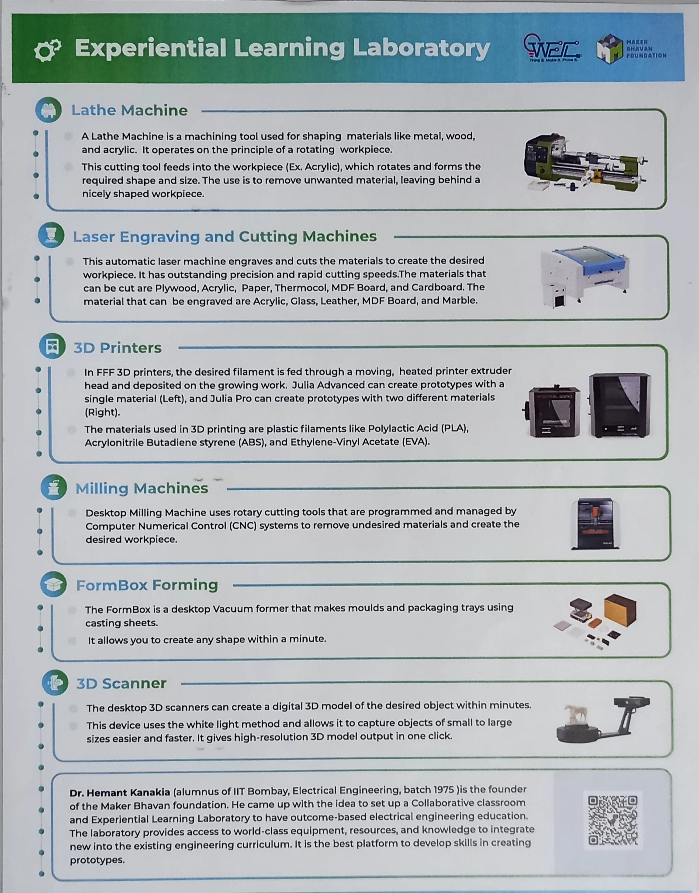
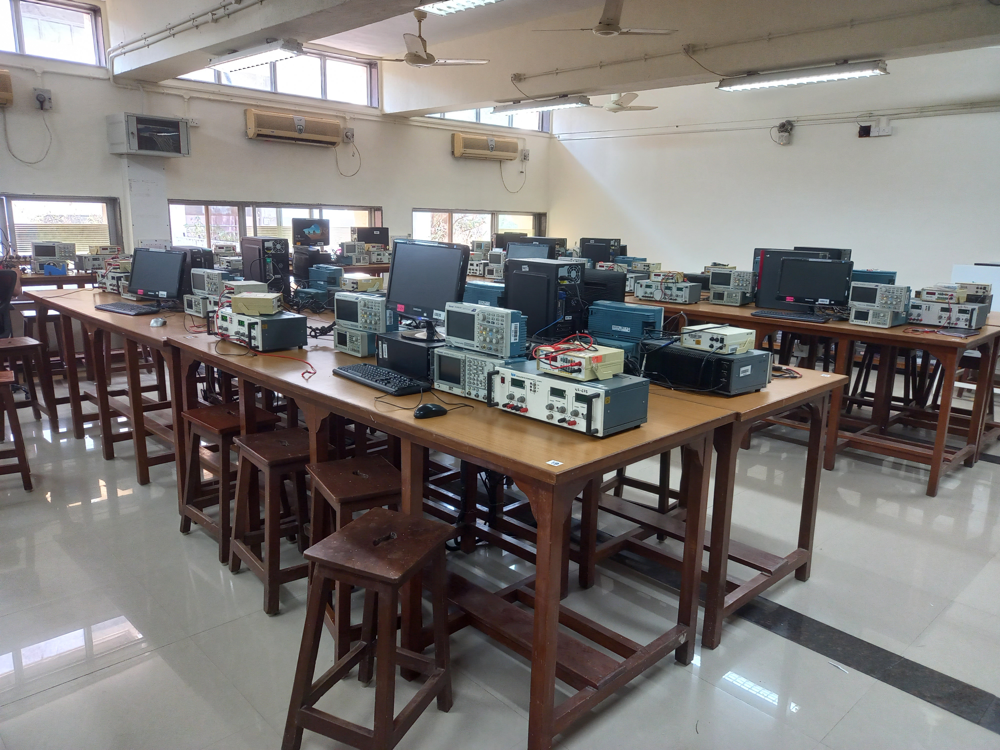
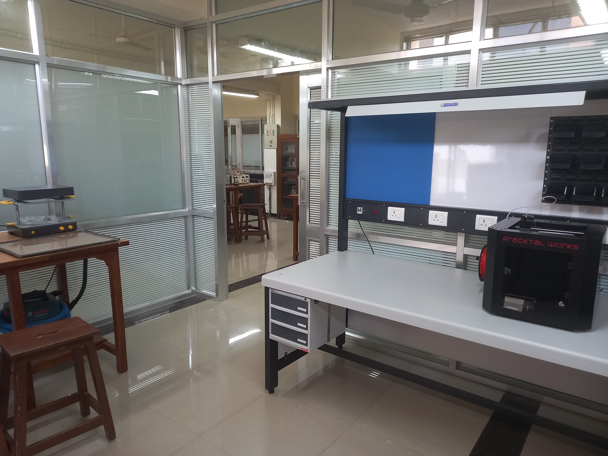
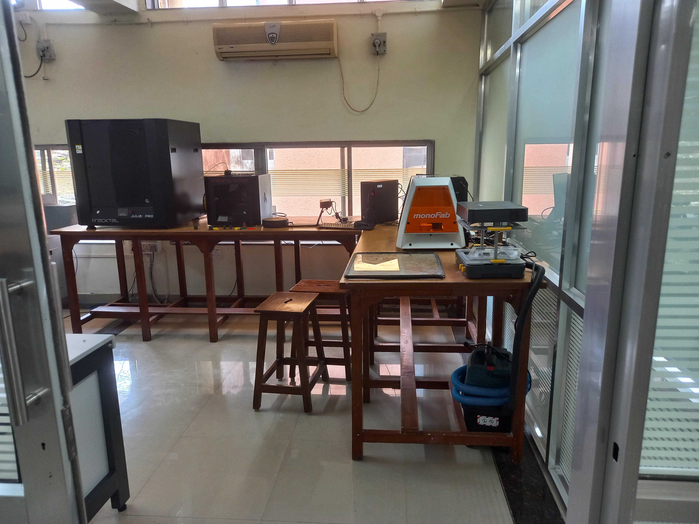
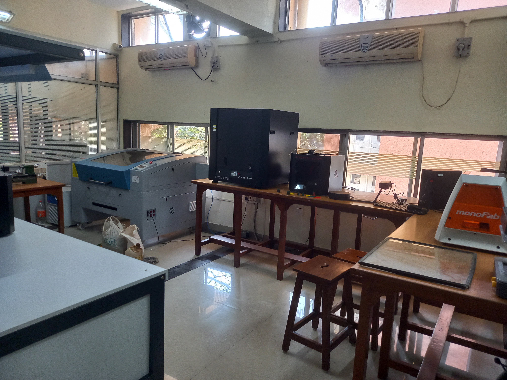

# Experiential Learning Laboratory

The Experiential Learning Laboratory was made possible with support from the Maker Bhavan Foundation. Where actually MBF is having a vision to reimagine engineering education by using hands-on learning and active learning pedagogy. The Foundation partner with science and engineering colleges of INDIA to provide access to world-class facilities , resources and expertise towards designing and supporting programs that integrates new methods of teaching and learning into their existing curriculum. 
Here this LAB is palying a vital role in Prototyping , which is related to different kind of works like Course works , Course Projects , B.Tech Projects , M.Tech Projects etc. as well as for learning purpose as well , for most of the students .   

## ELL Usages Introduction

## ELL Images

