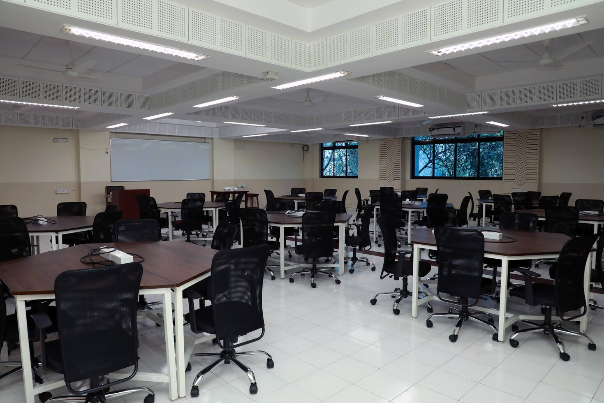
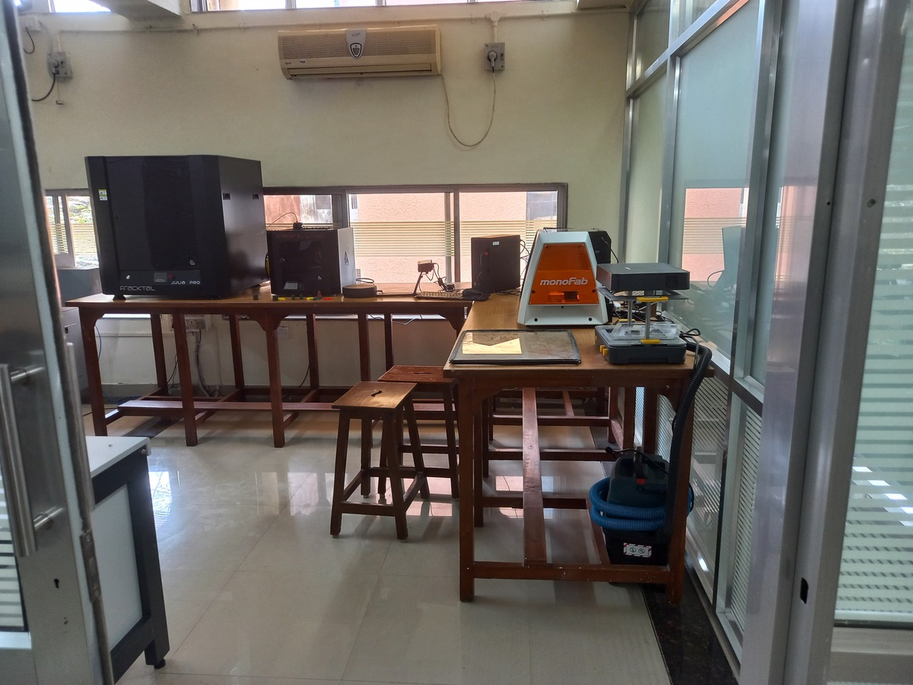

# Overview

[Maker Bhavan Foundation](https://makerbhavanfoundation.org) is a charity setup by IIT Bombay alumni with a mission to improve engineering education in India. The founders group of MBF includes Dr. Hemant Kanakia (BTech, EE, 1975), a Distinguished Alumnus of IIT Bombay.

In 2020, MBF initiated a donation of $200,000 to setup the Collaborative Classroom and the Experiential Learning Laboratory at the [Department of Electrical Engineering](https://www.ee.iitb.ac.in), IIT Bombay. These facilities were inaugurated on February 14, 2022.

## Collaborative Classroom
The Collaborative Classroom facilitates active learning in courses. It is located in EEG 401 (4th floor, GG Building) and has a seating capacity of 60 students.

The layout has 10 hexagonal tables, each seating 6 students. The classroom will be equipped with 20 laptops which can be used for computer-based exercises.

  [:octicons-arrow-right-24: More information][CC]

  [CC]: cc/index.md

## Experiential Learning Laboratory
The Experiential Learning Laboratory (ELL) will facilitate hands-on learning and has a capacity of 50 students. It is located in the WEL complex (3rd floor, old EE Building).

 
The ELL has a maker-area with double-paned glass walls, that houses equipment such as 3D printers, laser cutter, vacuum forming, desktop CNC milling machine, 3D scanner, lathe and hand-operated power tools for machining and making fixtures for projects.

  [:octicons-arrow-right-24: More information][ELL]

  [ELL]: ell/index.md

## About Maker Bhavan Foundation

Maker Bhavan Foundation’s vision is to reimagine engineering education by using
hands-on-learning and active learning pedagogy. The Foundation partners with science and
engineering colleges of India to provide access to world-class facilities, resources and expertise
towards designing and supporting programs that integrate new methods of teaching and
learning into their existing curriculum.

To know more visit [https://makerbhavanfoundation.org/](https://makerbhavanfoundation.org/)